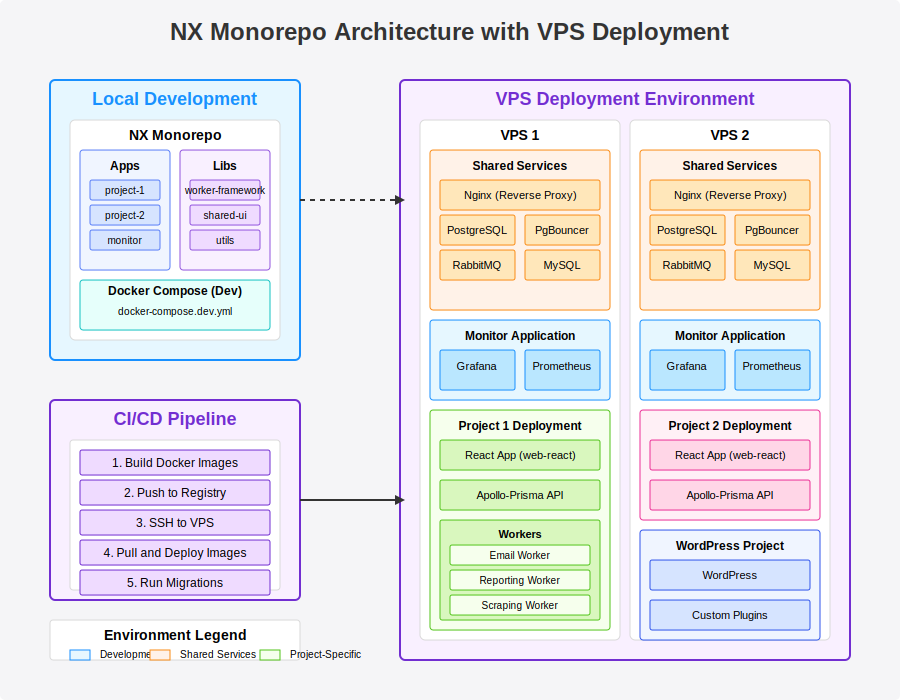

# Cambios pendientes

Separar de los proyectos apps/jupiter, etc.. la infraestructura

infra/hostinger-1/
infra/d-ocean-1/

separar project:create project:infra o create-infra

# Monorepo for Full-Stack Projects with NX and Docker

[](./architecture.svg)

This monorepo provides a structured and scalable foundation for developing and deploying multiple full-stack applications using NX, Docker, and a suite of modern technologies. It is designed to promote code sharing, consistent development workflows, and streamlined deployments to VPS environments.

## Overview

This monorepo embraces a monorepo approach, managing multiple related projects within a single repository. It leverages NX for build orchestration, dependency management, and code generation, and Docker for containerization and consistent environment setup across development, staging, and production.

**Key Features:**

* **Multi-Project Support:** Designed to host multiple independent full-stack projects (e.g., web applications, APIs, microservices, WordPress sites) within a single codebase.
* **NX Workspace:** Utilizes NX workspace features for efficient build processes, code sharing through libraries, and code generation.
* **Dockerized Environments:** Employs Docker and Docker Compose for consistent development, staging, and production environments, ensuring reproducibility and simplifying deployment.
* **Worker Framework:** Includes a robust `worker-framework` library for building asynchronous, queue-based background services (e.g., email sending, data scraping, reporting).
* **Centralized Monitoring:** Features a dedicated `monitor` application for deploying Grafana, Prometheus, and other monitoring tools on each VPS to observe application health and performance.
* **VPS Deployment Focused:** Architecture tailored for deployment to Virtual Private Servers (VPS), using Docker Compose for orchestration and Nginx as a central reverse proxy.
* **Environment Separation:** Clearly defined environments for development (`dev`), staging (`stage`), and production (`prod`), each with dedicated Docker Compose configurations and settings.
* **WordPress Integration:** Supports hosting WordPress sites as part of the monorepo, alongside other application types, utilizing MySQL/MariaDB for WordPress databases.
* **Automated SSL with Let's Encrypt:** Integration with Certbot for automatic SSL certificate generation and renewal for all domains managed by Nginx.
* **PgBouncer Connection Pooling:** Utilizes PgBouncer as a connection pooler for PostgreSQL to optimize database connection management and performance for projects using PostgreSQL.

## Directory Structure

```
apps/
├── project-1/
│   ├── apollo-prisma/
│   ├── web-react/
│   ├── worker-email/
│   ├── docker-compose.dev.yml
│   └── docker-compose.prod.yml
├── project-2/
│   └── ...
├── project-3/
│   └── ...
├── monitor/
│   └── docker-compose.monitor.yml
└── wordpress-project-1/
    └── docker-compose.yml
libs/
└── worker-framework/
    └── src/
tools/
└── create-worker/
    └── src/
vps-config/
├── vps1/
│   └── nginx/
└── vps2/
    └── nginx/
docs/
└── nginx-configuration.md
package.json
nx.json
README.md
```

## Environments

This monorepo is designed around distinct environments to support the software development lifecycle:

* **`dev` (Development):** Local development environment on developer machines. Utilizes Docker Compose (e.g., `docker-compose.dev.yml`) for a consistent and isolated development setup. Focus is on rapid iteration and debugging.
* **`stage` (Staging):** Pre-production environment deployed on a VPS, mirroring production as closely as possible. Used for integration testing, user acceptance testing (UAT), and final validation before production release. Uses `docker-compose.stage.yml` and a dedicated staging subdomain.
* **`prod` (Production):** Live production environment deployed on VPS, serving end-users. Utilizes `docker-compose.prod.yml` for optimized performance and stability. Accessed via the main domain.
* **`monitor` (Monitoring):** A dedicated environment, deployed on each VPS, for running monitoring tools (Grafana, Prometheus, etc.) via the `monitor` application. Provides insights into all environments running on that VPS.

## Local Development Network

The local development environment uses Docker Compose networks to mirror the production setup as closely as possible:

```yaml
# Example from docker-compose.dev.yml
networks:
  app-network:
    name: project-1-network
  shared-services:
    name: shared-services-network
    external: true
```

Key considerations for local development:

* **Shared Services Network:** A separate Docker Compose file (`docker-compose.shared.yml`) manages shared services (PostgreSQL, RabbitMQ, etc.) that are used across multiple projects.
* **Volume Mounts:** Source code is mounted as volumes to enable hot-reloading during development.
* **Development-Specific Services:** Services like nodemon for auto-restarting Node.js applications are included in development but not in production.
* **Environment Parity:** Port mappings, service names, and network configurations closely match production to minimize "works on my machine" issues.

## Worker Orchestration

The worker framework provides a standardized approach to building background processing services that integrate with RabbitMQ:

### Worker Architecture

* **Queue Definition:** Each worker defines its queue name, retry policy, and dead-letter strategy.
* **Message Schema:** TypeScript interfaces define the expected structure of messages.
* **Worker Registry:** A central registry allows discovery and management of all workers.

### RabbitMQ Configuration

* **Durable Queues:** All production queues are configured as durable to survive broker restarts.
* **Dead Letter Exchange:** Failed messages are routed to a dead-letter exchange for inspection and potential reprocessing.
* **Message TTL:** Messages have configurable time-to-live settings to prevent queue clogging.
* **Queue Prefetch:** Configurable prefetch limits prevent worker overload.

### Error Handling & Retry Strategy

* **Exponential Backoff:** Failed tasks are retried with increasing delays.
* **Error Classification:** Errors are classified as either retriable or terminal.
* **Monitoring Integration:** Failed tasks trigger alerts in the monitoring system.
* **Manual Intervention:** Admin interface allows inspection and manual reprocessing of failed messages.

## Database Migration Strategy

Database schema changes are managed with a zero-downtime approach:

### Prisma Migration Workflow

1. **Development Migrations:** Developers create migrations locally using Prisma Migrate.
2. **Version Control:** Migrations are committed to the repository and reviewed during code review.
3. **Deployment Process:** Migrations are automatically applied during the deployment process.

### Zero-Downtime Strategy

* **Backward Compatibility:** All schema changes maintain compatibility with previous application versions.
* **Multi-Phase Deployments:** Complex schema changes are split into multiple deployments:
  * Phase 1: Add new tables/columns without removing old ones
  * Phase 2: Update application code to use new schema
  * Phase 3: Remove deprecated schema elements after confirming no usage

### Database Backup Strategy

* **Pre-Migration Snapshots:** Automated snapshots are taken before migrations.
* **Point-in-Time Recovery:** Database systems are configured for point-in-time recovery.
* **Scheduled Backups:** Regular scheduled backups in addition to migration-triggered backups.

## Environment Variable Management

Secrets and configuration variables are managed securely across environments:

### Development Environment

* **`.env.local` Files:** Developers use local `.env` files that are git-ignored.
* **Example Templates:** Repository contains `.env.example` files with non-sensitive defaults.

### Staging and Production Environments

* **CI/CD Secrets:** Sensitive variables are stored in the CI/CD system's secure storage.
* **Runtime Injection:** Variables are injected into containers at runtime via Docker Compose environment files.
* **Secrets Rotation:** Process for regular rotation of production secrets.

### Configuration Hierarchy

* **Default Configs:** Base configuration values defined in code.
* **Environment-Specific Overrides:** Values overridden based on `NODE_ENV`.
* **Infrastructure-Specific Overrides:** Values specific to a particular VPS.
* **Secret Overrides:** Sensitive values overridden from secure storage.

## Deployment Process

### CI/CD Pipeline (GitHub Actions)

The deployment process is automated using GitHub Actions:

1. **Trigger:** Pipeline triggered on merge to main branch or manual workflow dispatch.
2. **Build Phase:**
   * Determine changed projects using NX affected commands
   * Build Docker images for affected projects
   * Tag images with commit SHA and environment name
   * Push images to container registry (GitHub Container Registry)
3. **Test Phase:**
   * Run unit tests for affected projects
   * Run integration tests for affected projects
   * Generate test reports and code coverage metrics
4. **Deploy Phase:**
   * Connect to target VPS via SSH
   * Pull latest Docker images
   * Run database migrations (if needed)
   * Update Docker Compose configuration
   * Restart services with zero-downtime strategy
5. **Verification Phase:**
   * Run health checks against newly deployed services
   * Verify monitoring is receiving metrics
   * Run smoke tests against critical endpoints

### Zero-Downtime Deployment Strategy

* **Rolling Updates:** Services are updated one at a time to maintain availability.
* **Health Checks:** New instances must pass health checks before old ones are removed.
* **Rollback Capability:** Automated rollback if health checks fail.
* **Blue-Green Deployments:** For critical services, a blue-green deployment approach is used.

## Scaling Strategy

The architecture supports horizontal scaling of individual components:

### Stateless Components

* **Frontend (React):** Can be scaled horizontally behind Nginx load balancer.
* **API Servers (Apollo):** Can be scaled horizontally with proper session management.
* **Workers:** Can be scaled by adding more instances consuming from the same queues.

### Stateful Components

* **PostgreSQL:** Primary-replica configuration with PgBouncer for connection pooling.
* **RabbitMQ:** Clustering configuration for high availability.

### Load Balancing

* **Nginx:** Acts as the entry point and load balancer for web traffic.
* **DNS Round-Robin:** For multi-VPS deployments, DNS round-robin provides basic load distribution.

### Auto-Scaling Considerations

* **Resource Monitoring:** CPU, memory, and queue length metrics used to trigger scaling.
* **Scaling Policies:** Documented thresholds and policies for when to scale resources.
* **Cost Management:** Guidelines for balancing performance needs with infrastructure costs.

## Resource Allocation

Guidelines for container resource allocation across environments:

### Development Environment

* **Memory Limits:** Generous limits to avoid development frustration.
* **CPU Shares:** Equal distribution with no hard limits.

### Staging Environment

* **Memory Limits:** Match production values to catch memory-related issues.
* **CPU Limits:** Match production values to catch performance bottlenecks.

### Production Environment

| Service Type | Min Memory | Recommended Memory | CPU Allocation |
|--------------|------------|-------------------|----------------|
| Web Frontend | 128MB      | 256MB             | 0.5 CPU        |
| API Server   | 256MB      | 512MB             | 1.0 CPU        |
| Worker       | 128MB      | 256MB             | 0.5 CPU        |
| PostgreSQL   | 512MB      | 1024MB            | 1.0 CPU        |
| RabbitMQ     | 256MB      | 512MB             | 0.5 CPU        |
| Nginx        | 128MB      | 256MB             | 0.5 CPU        |
| Monitor      | 512MB      | 1024MB            | 1.0 CPU        |

* **Overcommit Strategy:** Guidelines for CPU overcommit ratios based on typical utilization patterns.
* **Burst Handling:** Configuration for handling traffic spikes and temporary resource bursts.

## Monitoring and Observability

The monitoring application provides comprehensive visibility into the health and performance of all services:

### Metrics Collection

* **Prometheus:** Collects metrics from all services via exporters.
* **Node Exporter:** System-level metrics for each VPS.
* **Custom Exporters:** Application-specific metrics for business-level monitoring.

### Visualization and Alerting

* **Grafana:** Dashboards for visualizing metrics.
* **Alert Manager:** Configurable alerts based on thresholds.
* **PagerDuty Integration:** Escalation paths for critical alerts.

### Logging

* **Centralized Logging:** All container logs are collected and centralized.
* **Log Retention:** Configurable retention periods for different log types.
* **Log Analysis:** Tools for searching and analyzing logs.

### Application Performance Monitoring

* **Tracing:** Distributed tracing for tracking requests across services.
* **Error Tracking:** Aggregation and deduplication of application errors.
* **User Experience Monitoring:** Real user monitoring for frontend applications.

## Key Technologies

* **NX:** Build system, monorepo management, code generation.
* **Docker & Docker Compose:** Containerization, environment orchestration.
* **TypeScript:** Primary programming language.
* **React:** Frontend web application framework.
* **React Native (Optional):** Mobile application framework (for some projects).
* **Apollo Server & GraphQL:** Backend API framework for PostgreSQL-based projects.
* **Prisma:** ORM (Object-Relational Mapper) for PostgreSQL database access.
* **PostgreSQL:** Primary relational database system for most projects.
* **PgBouncer:** PostgreSQL connection pooler.
* **MySQL/MariaDB:** Relational database system specifically for WordPress projects.
* **RabbitMQ:** Message broker for asynchronous task processing.
* **Nginx:** Reverse proxy, web server, load balancer.
* **Grafana & Prometheus:** Monitoring and visualization tools.
* **Certbot (Let's Encrypt):** SSL certificate management.
* **Node.js:** Runtime environment for backend services and tooling.
* **GitHub Actions:** CI/CD automation platform.

## Documentation Index

* **Worker Framework:** [libs/worker-framework/README.md](./libs/worker-framework/README.md)
* **Nginx Configuration:** [docs/nginx-configuration.md](./docs/nginx-configuration.md)
* **[Project Documentation - To be added per project]** (e.g., [apps/project-1/README.md](./apps/project-1/README.md), [apps/project-2/README.md](./apps/project-2/README.md))
* **[Monitor Application Documentation - To be added]** (e.g., [apps/monitor/README.md](./apps/monitor/README.md))
* **VPS Configuration (`vps-config/`):** [See section below](#vps-configuration-vps-config)

## VPS Configuration (`vps-config/`)

The `vps-config/` directory at the root of the monorepo is dedicated to storing VPS-specific configurations for various services and applications deployed on the VPS. This separation ensures that VPS-level settings are kept distinct from the application code managed within the `apps/` and `libs/` directories, promoting cleaner configuration management and environment-specific adjustments.

**Structure of `vps-config/`:**

The `vps-config/` directory is organized primarily by VPS server. Each VPS server intended to be configured and managed has its own subdirectory (e.g., `vps1`, `vps2`, etc.). Within each VPS subdirectory, you'll find configurations related to different services running on that VPS:

```
vps-config/
├── vps1/                             # Configuration for VPS Server 1
│   ├── nginx/                        # Nginx configuration files for VPS 1 (reverse proxy, SSL, etc.)
│   │   ├── nginx.conf                # Main Nginx configuration for vps1
│   │   ├── sites-available/          # Virtual host configurations for domains/subdomains on vps1
│   │   │   ├── project-1.com.conf
│   │   │   ├── project-2.com.conf
│   │   │   ├── stage.project-1.com.conf
│   │   │   └── ...
│   │   └── certbot/                  # Certbot scripts/config for SSL certificate management on vps1
│   │       ├── renew-certificates.sh
│   │       └── ...
│   ├── postgresql/                   # PostgreSQL configuration for VPS 1 (if self-managed)
│   │   ├── docker-compose.yml        # Docker Compose file to deploy PostgreSQL on VPS 1
│   │   ├── postgresql.conf           # PostgreSQL server configuration overrides (optional)
│   │   └── pg_hba.conf               # PostgreSQL client authentication configuration (optional)
│   ├── pgbouncer/                    # PgBouncer configuration for VPS 1
│   │   ├── docker-compose.yml        # Docker Compose file to deploy PgBouncer on VPS 1
│   │   └── pgbouncer.ini             # PgBouncer configuration file
│   ├── mysql/                        # MySQL/MariaDB configuration for WordPress on VPS 1 (if self-managed)
│   │   ├── docker-compose.yml        # Docker Compose file for MySQL/MariaDB
│   │   ├── my.cnf                    # MySQL server configuration overrides (optional)
│   │   └── ...                       # Other MySQL configuration files if needed
│   ├── rabbitmq/                     # RabbitMQ configuration for VPS 1 (if self-managed)
│   │   ├── docker-compose.yml        # Docker Compose file for RabbitMQ
│   │   └── rabbitmq.conf             # RabbitMQ configuration file (optional)
│   ├── monitor/                      # Monitor application specific configuration for VPS 1 (if needed)
│   │   └── .env.monitor.vps1         # Example: .env variables for monitor app on VPS 1
│   └── wordpress/                    # WordPress specific VPS-level configurations (if needed)
│       └── ...
├── vps2/                             # Configuration for VPS Server 2
│   └── ...                           # Similar structure for VPS 2
└── ...                               # Configurations for other VPS servers
```

## Disaster Recovery Planning

The architecture includes provisions for recovering from various failure scenarios:

### Backup Strategy

* **Database Backups:** Regular automated backups of all databases.
* **Configuration Backups:** Version-controlled infrastructure configuration.
* **Application State Backups:** Backup of stateful application data.

### Recovery Procedures

* **Single Service Failure:** Documented procedures for recovering individual services.
* **Full VPS Failure:** Step-by-step process for recreating a VPS environment from scratch.
* **Data Corruption:** Procedures for restoring from backups with minimal data loss.

### Testing Recovery

* **Scheduled Drills:** Regular testing of recovery procedures.
* **Documentation Updates:** Continuous improvement of recovery documentation based on drill results.

## Security Considerations

Security measures implemented throughout the architecture:

### Network Security

* **VPS Firewalls:** Restrictive firewall rules allowing only necessary traffic.
* **Private Networks:** Internal services communicate over private networks.
* **HTTPS Everywhere:** All public endpoints use HTTPS with strong ciphers.

### Access Control

* **Principle of Least Privilege:** Services run with minimal required permissions.
* **SSH Key-Based Authentication:** No password authentication for server access.
* **Role-Based Access:** Different access levels for developers, operations, and monitoring.

### Secrets Management

* **No Hardcoded Secrets:** All secrets are injected via environment variables or secure storage.
* **Regular Rotation:** Schedule for rotating credentials and keys.
* **Audit Trail:** Logging of access to sensitive resources.

### Compliance Considerations

* **Data Protection:** Measures to protect user data according to relevant regulations.
* **Audit Logging:** Comprehensive logging of system and user activities.
* **Vulnerability Scanning:** Regular scanning of containers and dependencies for vulnerabilities.
