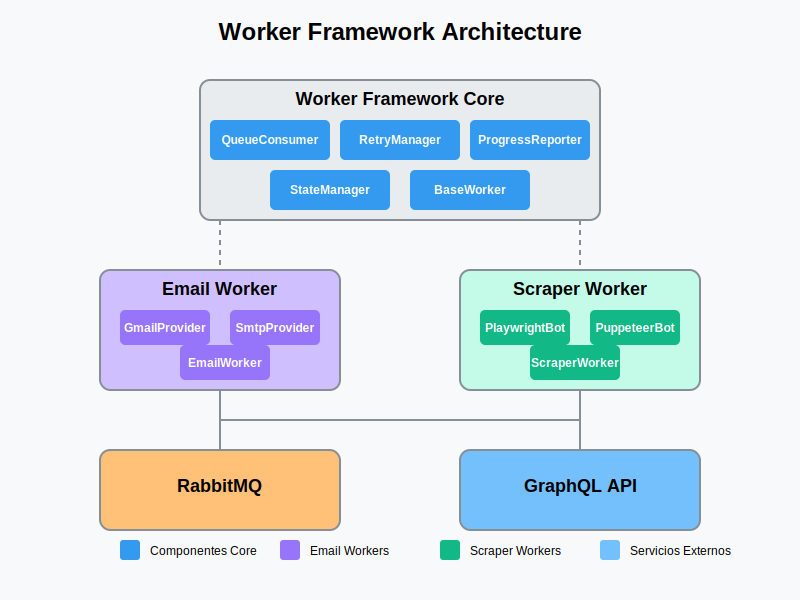

# Jupiter Worker Framework Guide



This guide explains how to use and extend the Worker Framework for creating asynchronous processing services.

## Table of Contents

- [Introduction](#introduction)
- [Project Structure](#project-structure)
- [Creating New Workers](#creating-new-workers)
- [Building & Running Workers](#building--running-workers)
- [NPM Scripts Reference](#npm-scripts-reference)
- [Worker Implementation Guide](#worker-implementation-guide)
- [Advanced Topics](#advanced-topics)

## Introduction

The Worker Framework is a TypeScript-based framework for creating standardized asynchronous processing services. It provides:

- Queue-based message processing via RabbitMQ
- Automatic retries with exponential backoff
- Progress reporting via GraphQL
- Consistent error handling
- Logging standardization
- Scalable architecture

Workers are standalone services that can perform various tasks like sending emails, scraping data, processing files, and more.

## Project Structure

```
jupiter-platform/
├── apps/                    # Worker services
│   ├── email-service/       # Email sending service
│   ├── scraper-anses/       # ANSES data scraper
│   └── ...                  # Other worker services
│
├── libs/                    # Shared libraries
│   ├── worker-framework/    # Core framework
│   └── shared-utils/        # Shared utilities
│
├── scripts/                 # Utility scripts
│   └── create-worker.js     # Worker creation script
│
└── package.json             # NPM configuration
```

## Creating New Workers

To ensure that it is compiled:
```bash
nx build tools/create-worker
```

To create a new worker service, use the direct creation script:

```bash
nx g scripts/create-worker.js <worker-name>
```

Example:
```bash
nx g create-worker:worker-generator scraper-anses
```

This will create a new worker service in `services/scraper-anses/` with the basic structure required to implement a scraper service.

To remove:
```bash
nx generate @nx/workspace:remove scraper-anses
```

### Worker Service Structure

Each worker service has the following structure:

```
apps/worker-name/
├── src/
│   ├── app/
│   │   └── worker-name.worker.ts   # Worker implementation
│   └── main.ts                     # Entry point
├── project.json                    # Nx project configuration
├── tsconfig.json                   # TypeScript configuration
└── Dockerfile                      # Docker configuration
```

## Building & Running Workers

### Building Workers

To build a specific worker:

```bash
# Build a specific worker
nx build <worker-name>

# Example
nx build scraper-anses
```

To build all workers:

```bash
npm run build
```

### Running Workers

To run a worker in development mode:

```bash
# Run in development mode (watches for changes)
nx serve <worker-name>

# Example
nx serve scraper-anses
```

To run a built worker:

```bash
# Run the built version
node dist/apps/<worker-name>/main.js

# Example
node dist/apps/scraper-anses/main.js
```

## NPM Scripts Reference

The following NPM scripts are available:

| Script | Description |
|--------|-------------|
| `npm run create-worker` | Shortcut to run the worker creation script |
| `npm run build` | Builds all projects |
| `npm run build:framework` | Builds only the framework |
| `npm run build:email` | Builds the email service |
| `npm run build:worker <name>` | Builds a specific worker |
| `npm run serve:email` | Runs the email service |
| `npm run serve:worker <name>` | Runs a specific worker |
| `npm test` | Runs all tests |
| `npm run test:framework` | Tests the framework |
| `npm run test:worker <name>` | Tests a specific worker |
| `npm run lint` | Lints all projects |
| `npm run lint:worker <name>` | Lints a specific worker |

## Worker Implementation Guide

When implementing a new worker, you typically need to:

1. **Define the Task Interface**: Define the structure of tasks your worker will process.

2. **Define the Result Interface**: Define the structure of results your worker will produce.

3. **Implement Required Methods**:
   - `initialize()`: Set up resources (databases, APIs, etc.)
   - `executeTask()`: Implement the specific task logic
   - `isPermanentError()`: Define what errors should not be retried
   - `getWorkerType()`: Return the worker type (for logging)
   - `getInitialStep()`: Define the first step in processing

### Example Implementation

```typescript
// Sample worker implementation
export class ScraperAnsesWorker extends BaseWorker<ScraperAnsesWorkerTask, ScraperAnsesWorkerResult> {
  // Configuration
  private scraperConfig: ScraperAnsesWorkerConfig['scraper'];
  
  constructor(config: ScraperAnsesWorkerConfig) {
    super(config);
    this.scraperConfig = config.scraper;
  }
  
  protected getWorkerType(): string {
    return 'scraper';
  }
  
  protected async initialize(): Promise<void> {
    // Initialize resources
    logger.info('ScraperAnsesWorker initialized');
  }
  
  protected async executeTask(task: ScraperAnsesWorkerTask, context: TaskContext): Promise<ScraperAnsesWorkerResult> {
    // Task implementation
    this.log(context, 'info', `Processing ANSES data for ${task.targetId}`);
    
    // Your implementation here
    
    return {
      id: task.id,
      processedAt: new Date().toISOString(),
      status: 'completed',
      data: { /* result data */ }
    };
  }
  
  protected isPermanentError(error: any, task: ScraperAnsesWorkerTask): boolean {
    // Define permanent errors that shouldn't be retried
    if (error instanceof WorkerError) {
      return error.permanent;
    }
    
    return false;
  }
  
  protected getInitialStep(task: ScraperAnsesWorkerTask): string {
    return `Starting ANSES data processing for ${task.targetId}`;
  }
}
```

## Advanced Topics

### Handling Retries

The framework automatically handles retries with exponential backoff. You can control this behavior by:

1. **Configuring Retry Parameters**:
   - `maxRetries`: Maximum number of retry attempts
   - `initialDelayMs`: Initial delay before first retry
   - `backoffFactor`: How quickly retry delay increases
   - `maxDelayMs`: Maximum delay between retries

2. **Defining Permanent Errors**: Implement the `isPermanentError()` method to identify errors that should not be retried.

### Reporting Progress

For long-running tasks, you can report progress:

```typescript
// Report progress during task execution
await this.progressReporter.reportProgress(task.id, {
  status: TaskStatus.PROCESSING,
  progress: 50, // percentage
  currentStep: 'Processing page 2/4'
});
```

### Testing Workers

Create tests for your workers in the `apps/<worker-name>/src/app/<worker-name>.worker.spec.ts` file. You can mock dependencies and test the worker logic in isolation.

### Containerization

Each worker includes a Dockerfile for easy containerization. To build a Docker image:

```bash
# Build the Docker image
docker build -f apps/<worker-name>/Dockerfile -t jupiter/<worker-name>:latest .

# Example
docker build -f apps/scraper-anses/Dockerfile -t jupiter/scraper-anses:latest .
```

To run the containerized worker:

```bash
docker run -d --name <worker-name> jupiter/<worker-name>:latest
```

---

For more detailed information about specific components, refer to the documentation in the source code.
