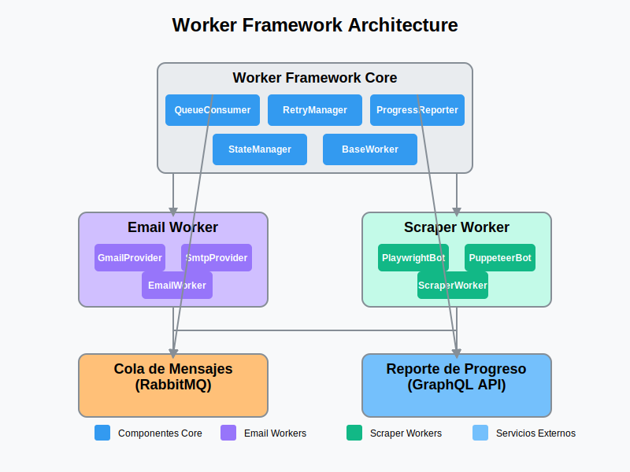

# Jupiter Worker Framework Guide



This guide explains how to use and extend the Worker Framework for creating asynchronous processing services.

## Table of Contents

- [Introduction](#introduction)
- [Project Structure](#project-structure)
- [Creating New Workers](#creating-new-workers)
- [Building & Running Workers](#building--running-workers)
- [Deployment](#deployment)
- [NPM Scripts Reference](#npm-scripts-reference)
- [Worker Implementation Guide](#worker-implementation-guide)
- [Advanced Topics](#advanced-topics)

## Introduction

The Worker Framework is a TypeScript-based framework for creating standardized asynchronous processing services. It provides:

- Queue-based message processing via RabbitMQ
- Automatic retries with exponential backoff
- Progress reporting via GraphQL
- Consistent error handling
- Logging standardization
- Scalable architecture

Workers are standalone services that can perform various tasks like sending emails, scraping data, processing files, and more.  Within this monorepo structure, workers are organized within specific projects.

## Project Structure

```
jupiter-platform/
├── apps/                    # Applications - including worker services
│   ├── jupiter/             # Project: Jupiter
│   │   ├── email-worker/    # Email sending service for Jupiter project
│   │   ├── scraper-worker/  # Data scraper for Jupiter project
│   │   └── ...              # Other worker services for Jupiter project
│   │
│   ├── analysa/           # Project: Analysa
│   │   ├── reporting-worker/ # Reporting service for Analysa project
│   │   └── ...              # Other worker services for Analysa project
│   │
│   └── ...                  # Other projects with their worker services
│
├── libs/                    # Shared libraries
│   ├── worker-framework/    # Core framework
│   └── shared-utils/        # Shared utilities
│
├── tools/                   # Tools and utilities for the monorepo
│   └── create-worker/       # NX Generator for creating new worker services
│       ├── src/
│       │   └── generators/
│       │       └── worker-generator/
│       │           └── ... (Generator implementation files)
│       └── ...             # Generator configuration and definition
│
└── package.json             # NPM configuration
```

## Creating New Workers

New worker services are created using the NX generator `@tools/create-worker:worker-generator`. This generator sets up the basic structure for a new worker within a specified project.

To create a new worker service, use the NX CLI to invoke the generator:

```bash
nx generate @tools/create-worker:worker-generator <worker-name> --project <project-name>
```

**Important:**  You **must** specify the `--project` option to indicate which project (under `apps/`) the new worker should belong to.

Example:
```bash
nx generate @tools/create-worker:worker-generator email-sender --project jupiter
```

This command will:

- Create a new worker service named `email-sender`.
- Place it within the `apps/jupiter/` directory.
- Generate the necessary files (worker implementation template, entry point, NX project configuration, TypeScript configuration, and Dockerfile).

To remove a worker service, use the NX `remove` generator, specifying the full path to the worker project:

```bash
nx generate @nx/workspace:remove apps/jupiter/email-sender # Example path - adjust as needed
```

### Worker Service Structure

Each worker service created by the generator within a project has the following structure:

```
apps/<project-name>/<worker-name>/
├── src/
│   ├── app/
│   │   └── <worker-name>.worker.ts   # Worker implementation
│   └── main.ts                     # Entry point
├── project.json                    # Nx project configuration
├── tsconfig.json                   # TypeScript configuration
└── Dockerfile                      # Docker configuration
```

**Example:** For the `email-sender` worker within the `jupiter` project:

```
apps/jupiter/email-sender/
├── src/
│   ├── app/
│   │   └── email-sender.worker.ts
│   └── main.ts
├── project.json
├── tsconfig.json
└── Dockerfile
```


## Building & Running Workers

### Building Workers

To build a specific worker within a project:

```bash
# Build a specific worker (specify project and worker name)
nx build apps/<project-name>/<worker-name>

# Example: Build the email-sender worker in the jupiter project
nx build apps/jupiter/email-sender
```

To build all projects, including all workers across all projects:

```bash
nx build
```

Or to build all projects in the workspace (using the root `package.json` script):

```bash
npm run build
```


### Running Workers

To run a worker in development mode:

```bash
# Run in development mode (watches for changes) - specify project and worker name
nx serve apps/<project-name>/<worker-name>

# Example: Run the email-sender worker in the jupiter project
nx serve apps/jupiter/email-sender
```

To run a built worker:

```bash
# Run the built version - adjust path to the built output
node dist/apps/<project-name>/<worker-name>/main.js

# Example: Run the built email-sender worker in the jupiter project
node dist/apps/jupiter/email-sender/main.js
```

## Deployment

Workers are designed to be easily deployed in containerized environments. Key aspects of deployment include:

- **Dockerization:** Each worker service includes a `Dockerfile` within its project directory (`apps/<project-name>/<worker-name>/Dockerfile`). This `Dockerfile` allows you to build a Docker image for the worker.

- **Docker Compose Orchestration:** Docker Compose is the primary tool for orchestrating worker deployments. Project-level `docker-compose.yml` files (e.g., `apps/<project-name>/docker-compose.yml`) will be used to define how worker services within a project are run alongside their dependencies.

- **VPS Deployment:** For VPS deployments, Docker Compose will manage the application stack for each project, including its worker services.  Project-specific `docker-compose.prod.yml` configurations will ensure production-ready deployments.

- **CI/CD Integration (Future):**  The framework is designed for CI/CD integration to automate building, testing, and deploying worker services and projects.

## NPM Scripts Reference

It's recommended to use NX commands directly for building, serving, testing, and linting projects within the monorepo as NX provides optimized task execution and dependency awareness.  While you can define NPM scripts in your root `package.json` to wrap NX commands for convenience, understanding the underlying NX commands is beneficial.

Here's a reference to common NX commands and example NPM scripts that you might configure:

| Script | Description | NX Command (Recommended) | Example NPM Script (package.json) |
|---|---|---|---|
| **Building** | | | |
| Build All Projects | Builds all applications and libraries in the workspace. | `nx build` | `"build": "nx build"` |
| Build Worker Framework | Builds specifically the `worker-framework` library. | `nx build libs/worker-framework` | `"build:framework": "nx build libs/worker-framework"` |
| Build Create Worker Generator | Builds the `create-worker` NX generator tool. | `nx build tools/create-worker` | `"build:create-worker": "nx build tools/create-worker"` |
| Build Specific Worker | Builds a specific worker service within a project.  Replace `<project-name>` and `<worker-name>` with your actual project and worker names. | `nx build apps/<project-name>/<worker-name>` | `"build:worker": "nx build apps/$npm_package_config_projectName/$npm_package_config_workerName"` <br> (Example usage in worker's `package.json`: `"build:worker": "nx build apps/jupiter/email-sender"`) |
| **Serving (Development)** | | | |
| Serve Specific Worker | Runs a specific worker service in development mode with live-reloading. Replace `<project-name>` and `<worker-name>` accordingly. | `nx serve apps/<project-name>/<worker-name>` | `"serve:worker": "nx serve apps/$npm_package_config_projectName/$npm_package_config_workerName"` <br> (Example usage in worker's `package.json`: `"serve:worker": "nx serve apps/jupiter/email-sender"`) |
| **Testing** | | | |
| Test All Projects | Runs unit tests for all testable projects in the workspace. | `nx test` | `"test": "nx test"` |
| Test Worker Framework | Runs unit tests specifically for the `worker-framework` library. | `nx test libs/worker-framework` | `"test:framework": "nx test libs/worker-framework"` |
| Test Specific Worker | Runs unit tests for a specific worker service. Replace `<project-name>` and `<worker-name>`. | `nx test apps/<project-name>/<worker-name>` | `"test:worker": "nx test apps/$npm_package_config_projectName/$npm_package_config_workerName"` |
| **Linting** | | | |
| Lint All Projects | Runs linting for all projects in the workspace. | `nx lint` | `"lint": "nx lint"` |
| Lint Specific Worker | Runs linting for a specific worker service. Replace `<project-name>` and `<worker-name>`. | `nx lint apps/<project-name>/<worker-name>` | `"lint:worker": "nx lint apps/$npm_package_config_projectName/$npm_package_config_workerName"` |

**Notes:**

*   **Project and Worker Names:**  When using commands like `nx build apps/<project-name>/<worker-name>`, replace `<project-name>` and `<worker-name>` with the actual names of your project (e.g., `jupiter`) and worker service (e.g., `email-sender`).
*   **NPM Script Variables:** The "Example NPM Script" column shows how you might define scripts in your `package.json`.  It uses environment variables like `$npm_package_config_projectName` and `$npm_package_config_workerName`.  These are placeholders.  You would typically set up these variables or hardcode the project/worker names directly in your scripts depending on your needs.  For more dynamic scripts, you might need to use more advanced scripting techniques within your `package.json` or use a task runner directly.
*   **Direct NX Commands Preferred:**  For most cases, using the direct `nx` commands in your terminal is the most straightforward and recommended approach for development and CI/CD.  NPM scripts are often used as wrappers for frequently used NX commands to simplify execution or for integration with other tooling.
*   **Adjustments May Be Needed:**  The example NPM scripts and even the NX commands might require adjustments based on the specific configuration of your monorepo, project names, worker names, and any custom tooling you introduce.  Always refer to the NX documentation and adapt these examples to your particular context.

---

Please replace the existing "NPM Scripts Reference" section in your `WORKER-FRAMEWORK.md` file with this updated version.  This version focuses on clearly documenting the NX commands and provides examples of how you *could* wrap them in NPM scripts. Let me know if you have any other questions or adjustments!
## Worker Implementation Guide

*(This section remains largely the same as the core worker implementation principles are unchanged)*

When implementing a new worker, you typically need to:

1. **Define the Task Interface**: Define the structure of tasks your worker will process.

2. **Define the Result Interface**: Define the structure of results your worker will produce.

3. **Implement Required Methods**:
   - `initialize()`: Set up resources (databases, APIs, etc.)
   - `executeTask()`: Implement the specific task logic
   - `isPermanentError()`: Define what errors should not be retried
   - `getWorkerType()`: Return the worker type (for logging)
   - `getInitialStep()`: Define the first step in processing

### Example Implementation

```typescript
// Sample worker implementation
export class ScraperAnsesWorker extends BaseWorker<ScraperAnsesWorkerTask, ScraperAnsesWorkerResult> { // Class name might be adjusted per worker
  // Configuration
  private scraperConfig: ScraperAnsesWorkerConfig['scraper']; // Config interface adjusted per worker

  constructor(config: ScraperAnsesWorkerConfig) { // Config interface adjusted per worker
    super(config);
    this.scraperConfig = config.scraper;
  }

  protected getWorkerType(): string {
    return 'scraper'; // Adjust worker type identifier
  }

  protected async initialize(): Promise<void> {
    // Initialize resources
    logger.info('ScraperAnsesWorker initialized'); // Logger instance - ensure consistent logging setup
  }

  protected async executeTask(task: ScraperAnsesWorkerTask, context: TaskContext): Promise<ScraperAnsesWorkerResult> { // Task and Result interfaces adjusted per worker
    // Task implementation
    this.log(context, 'info', `Processing ANSES data for ${task.targetId}`); // Logger instance

    // Your implementation here

    return {
      id: task.id,
      processedAt: new Date().toISOString(),
      status: 'completed',
      data: { /* result data */ }
    };
  }

  protected isPermanentError(error: any, task: ScraperAnsesWorkerTask): boolean { // Task interface adjusted per worker
    // Define permanent errors that shouldn't be retried
    if (error instanceof WorkerError) { // WorkerError class - ensure consistent error handling
      return error.permanent;
    }

    return false;
  }

  protected getInitialStep(task: ScraperAnsesWorkerTask): string { // Task interface adjusted per worker
    return `Starting ANSES data processing for ${task.targetId}`;
  }
}
```

## Advanced Topics

*(This section remains the same as the advanced topics are conceptually unchanged)*

This section delves into more advanced considerations for developing and managing worker services within the framework.

#### Horizontal Scalability

Worker services are designed to be horizontally scalable. To handle increased task loads, you can run multiple instances of the same worker service concurrently.  These instances can all connect to the same RabbitMQ queue. RabbitMQ ensures that each task from the queue is processed by only one worker instance, effectively distributing the workload.  Scaling horizontally involves adjusting the number of worker instances based on queue length and processing demands. Containerization via Docker makes it easy to manage and scale worker instances.

#### Worker-Specific Monitoring

Beyond general application monitoring, worker services benefit from specific monitoring to track their performance and health. This includes:

- **Structured Logging:** Implementing structured logging within workers allows for easier analysis of worker behavior, task processing times, and error occurrences. Logs can be aggregated and analyzed using tools like Elasticsearch, Loki, or similar logging platforms.
- **Custom Metrics:** Exposing custom metrics from worker services provides insights into task processing rates, queue depths, retry counts, and error rates. Prometheus exporters can be integrated into worker services to collect and expose these metrics.
- **Grafana Dashboards:** Creating Grafana dashboards tailored to worker metrics allows for real-time visualization of worker performance, enabling proactive identification of bottlenecks or issues. Dashboards can display queue lengths, processing times, success/failure rates, and other relevant worker-specific data.

#### Security Considerations

Security is paramount when developing worker services, especially as they often handle sensitive data or interact with external systems.  Key security considerations include:

- **Secret Management:** Securely manage API keys, database credentials, and other secrets required by worker services. Avoid hardcoding secrets in code or configuration files. Use environment variables or dedicated secret management solutions (like HashiCorp Vault, AWS Secrets Manager, etc.) to inject secrets into worker containers at runtime.
- **Input Validation:** Thoroughly validate all inputs to worker tasks to prevent injection attacks and ensure data integrity.
- **Least Privilege:** Grant worker services only the necessary permissions to access resources (databases, APIs, queues). Follow the principle of least privilege to minimize the potential impact of security breaches.
- **Secure Communication:** Ensure secure communication channels when workers interact with external services or internal components. Use HTTPS for API calls and consider encryption for message queues if handling sensitive data.

#### Advanced Testing Strategies

While unit tests are crucial for verifying individual worker logic, more comprehensive testing strategies are essential for robust worker services:

- **Integration Testing:** Integration tests verify the interaction of worker services with external dependencies, such as RabbitMQ and databases. These tests ensure that workers can correctly send and receive messages from queues, interact with databases as expected, and handle external API calls.
- **End-to-End Testing:** End-to-end tests validate complete task processing flows, from task enqueueing to result reporting. These tests simulate real-world scenarios and ensure that the entire worker system functions correctly as a whole. They can involve setting up temporary RabbitMQ queues and databases for testing purposes.
- **Performance Testing:** Performance testing helps assess the scalability and responsiveness of worker services under load. Tools like load generators can simulate high task volumes to identify performance bottlenecks and ensure workers can handle expected workloads.

---

For more detailed information about specific components, refer to the documentation in the source code.
```
